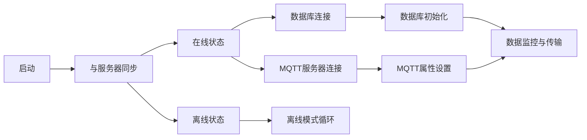
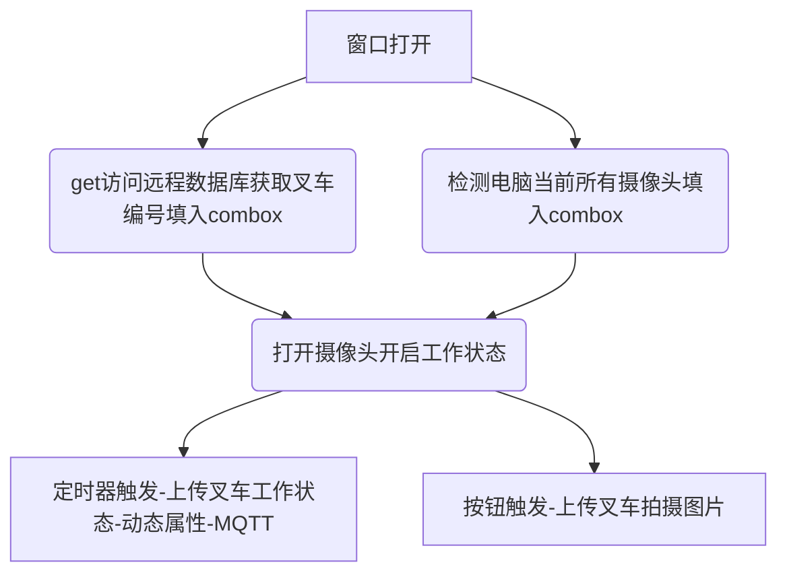

# 叉车称重数据采集系统

[界面演示](https://yplearning.github.io/MyPages/)

## 服务端

### 运行环境

- 系统：Linux
- 语言：Go
- 数据库：MySQL

### 数据库

#### 数据表

- 叉车信息表（car_info）

| 列名       | 类型        | 备注 |
| ---------- | ----------- | ---- |
| Cnumber    | VARCHAR(10) | 主键 |
| Cmodel     | VARCHAR(50) |      |
| Cratedload | FLOAT(10)   |      |
| Cpower     | VARCHAR(10) |      |

- 叉车动态状态表（car_status_"Cnumber"）
- SQL示例（CREATE TABLE `forklift`.`car_status_C02` ( `time` DATETIME NOT NULL , `status` BOOLEAN NOT NULL , `load` FLOAT(10) NOT NULL , `positionx` FLOAT(10) NOT NULL , `positiony` FLOAT(10) NOT NULL , PRIMARY KEY (`time`)) ENGINE = InnoDB;）

| 列名      | 类型      | 备注 |
| --------- | --------- | ---- |
| time      | DATETIME  | 主键 |
| status    | BOOLEAN   |      |
| load      | FLOAT(10) |      |
| positionx | FLOAT(10) |      |
| positiony | FLOAT(10) |      |

- 叉车拍照信息表（car_pic_"Cnumber"）
- SQL示例（CREATE TABLE `forklift`.`car_pic_C01` ( `time` DATETIME NOT NULL , `physicalpath` VARCHAR(50) NOT NULL , `webpath` VARCHAR(50) NOT NULL , PRIMARY KEY (`time`)) ENGINE = InnoDB;）

| 列名         | 类型        | 备注 |
| ------------ | ----------- | ---- |
| time         | DATETIME    | 主键 |
| physicalpath | VARCHAR(50) |      |
| webpath      | VARCHAR(50) |      |

### 接口设置

#### 客户端访问接口

## 客户端

### 支持环境

- windows

### 功能说明

#### 工作流程

##### 初始化

#### 静态属性设置

| 属性       | 说明                             | 类型   | 可选值      | 默认值        |
| ---------- | -------------------------------- | ------ | ----------- | ------------- |
| Cnumber    | 实际叉车编号需求（公司指定编号） | String | ——          | C01           |
| Cmodel     | 实际叉车型号                     | String | ——          | CPC(D)10-TEST |
| Cratedload | 叉车额定载重（kg）               | float  | >0          | 1000          |
| Cpower     | 叉车动力源                       | String | 内燃机/电动 | 内燃机        |

#### 动态属性设置

| 属性     | 说明             | 类型  | 可选值                    | 示例                             |
| -------- | ---------------- | ----- | ------------------------- | -------------------------------- |
| status   | 叉车工作状态     | bool  | true/false                | status = true                    |
| load     | 叉车当前载重     | float | >0                        | load = 666.6                     |
| position | 叉车当前位置坐标 | JSON  | {"X":"float","Y":"float"} | position = {"X":"20.8","Y":"40"} |

#### 服务器连接