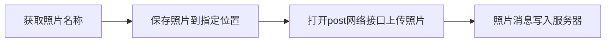

# 图片上传

- 流程

```mermaid
graph LR
获取照片名称 --> 保存照片到指定位置
保存照片到指定位置 --> 打开post网络接口上传照片
打开post网络接口上传照片 --> 照片消息写入服务器

```

## 服务端

## 客户端

http://127.0.0.1:8080/C01/C01_1621264089.Jpeg
### 照片命名规则

- 叉车编号 + _ + 日期时间（精确到秒）+ .Jpeg
  - 示例：C01_1621262524.Jpeg

